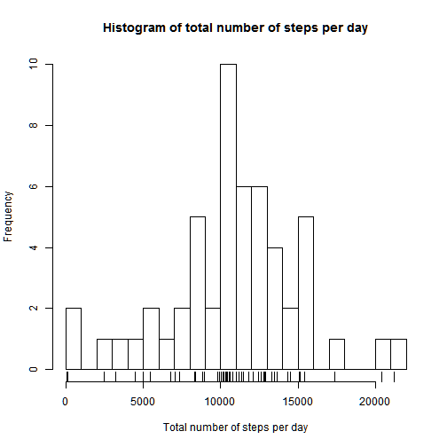
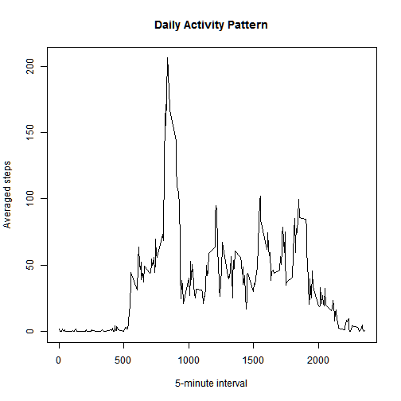
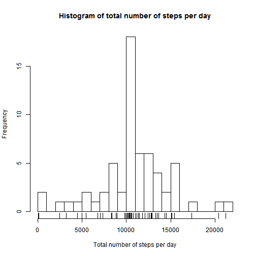
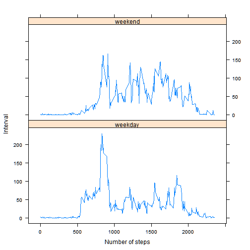

# Reproducible Research - Course Poject

## Loading and preprocessing the data


```r
# Load the data
activity <- read.csv("activity.csv")
# See the names of the variables in the dataframe
names(activity)
```

```
## [1] "steps"    "date"     "interval"
```

```r
# A quickly inspection to the data
summary(activity)
```

```
##      steps                date          interval     
##  Min.   :  0.00   2012-10-01:  288   Min.   :   0.0  
##  1st Qu.:  0.00   2012-10-02:  288   1st Qu.: 588.8  
##  Median :  0.00   2012-10-03:  288   Median :1177.5  
##  Mean   : 37.38   2012-10-04:  288   Mean   :1177.5  
##  3rd Qu.: 12.00   2012-10-05:  288   3rd Qu.:1766.2  
##  Max.   :806.00   2012-10-06:  288   Max.   :2355.0  
##  NA's   :2304     (Other)   :15840
```

## What is mean total number of steps taken per day?

**1. Number of the steps taken per day:**

```r
steps_by_date <- aggregate(steps ~ date, data=activity, FUN=sum)
```
**2. Histogram of the total number of steps taken each day:**

```r
hist(steps_by_date$steps ,breaks = 20,main = "Histogram of total number of steps per day",
     xlab = "Total number of steps per day")
rug(steps_by_date$steps)
```

 

**3. *Mean* and  *Median* of the total number of steps taken per day:**

```r
mean.steps_by_date <- mean(steps_by_date$steps)
median.steps_by_date <- median(steps_by_date$steps)
```
The **mean** is 1.0766189 &times; 10<sup>4</sup>, and the **median** is 10765

## What is the average daily activity pattern?
**1. Time series plot of the 5-minute interval (x-axis) and the average number of steps taken, averaged across all days (y-axis)**

```r
meansteps_by_interval <- aggregate(steps ~ interval, data = activity, FUN=mean)
# Make the plot
plot(meansteps_by_interval,type = "l", main = "Daily Activity Pattern",
     xlab = "5-minute interval", ylab = "Averaged steps")
```

 

**2.Which 5-minute interval, on average across all the days in the dataset, contains the maximum number of steps?**

```r
meansteps_by_interval[which.max(meansteps_by_interval$steps),]$interval
```

```
## [1] 835
```
So, the interval 835 (at 02:55), on average across all the days in the dataset, contains the maximum number of steps

## Imputing missing values

Note that there are a number of days/intervals where there are missing values (coded as NA). The presence of missing days may introduce bias into some calculations or summaries of the data.  

**1. Calculate and report the total number of missing values in the dataset (i.e. the total number of rows with NAs)**  
As we saw in the summary of the activty dataset, there are 2034 NA values in activity$steps.
Lets's corroborate it:

```r
sum(sapply(activity$steps,is.na))
```

```
## [1] 2304
```
As expected, there are 2304 missing values in the data set.  

**2. Devise a strategy for filling in all of the missing values in the dataset. For example, you could use the mean/median for that day, or the mean for that 5-minute interval, etc.**  
Let's replace those missing values by their respective 5-minute interval mean.  

```r
# Create a vector containing the indices of the missing values in the activity data frame
na.indices <- which(!complete.cases(activity))
# or which(!is.na(activity$steps)); because in this particular case, the NA values are only in the steps column
# Interval where there are missing values
na.intervals <- activity$interval[na.indices]
# Mean total number of steps taken per interval of those intervals
na.meansteps_by_interval <- meansteps_by_interval$steps[sapply(na.intervals,
                                function(x) which(x == meansteps_by_interval$interval))]
```
**3. Create a new dataset that is equal to the original dataset but with the missing data filled in.**

```r
# Copy the data set into a new one
activity_tidy <- activity

# Replace the missing values in the new data frame by the median total number of steps taken in their
# correspondieg intervals
activity_tidy$steps[na.indices] <- na.meansteps_by_interval
```

**4.a Make a histogram of the total number of steps taken each day and Calculate and report the mean and median total number of steps taken per day.**

```r
steps_by_date_tidy <- aggregate(steps ~ date, data = activity_tidy, FUN=sum)
hist(steps_by_date_tidy$steps ,breaks = 20,main = "Histogram of total number of steps per day",
     xlab = "Total number of steps per day")
rug(steps_by_date_tidy$steps)
```

 

```r
mean.steps_by_date_tidy <- mean(steps_by_date_tidy$steps)
median.steps_by_date_tidy <- median(steps_by_date_tidy$steps)
```
The **mean** is 1.0766189 &times; 10<sup>4</sup>, and the **median** is 10765

**4.b Do these values differ from the estimates from the first part of the assignment? What is the impact of imputing missing data on the estimates of the total daily number of steps?**

The **mean** is the same as in the first case, because we have filled in the missing values the mean value for that particular 5-minute interval.

The **median** has changed, but still very similar than the first case.

## Are there differences in activity patterns between weekdays and weekends?

**1. Create a new factor variable in the dataset with two levels - "weekday" and "weekend" indicating whether a given date is a weekday or weekend day.**


```r
# Load the dplyr package
library(dplyr)
# Create thenew factor variable usign the pipeline operator
activity_tidy$day <- (activity_tidy 
                      %>% mutate(date = as.Date(date)) 
                      %>% mutate(date = strftime(date,"%u")) 
                      %>% mutate(date = ifelse(date>5,"weekend", "weekday")) 
                      %>% mutate(date = as.factor(date)))$date
```

**2. Make a panel plot containing a time series plot of the 5-minute interval (x-axis) and the average number of steps taken, averaged across all weekday days or weekend days (y-axis).**


```r
# Load the lattice package
library(lattice)
meansteps_by_interval_by_day <- aggregate(steps ~ interval + day, data = activity_tidy, FUN = mean)
xyplot(steps ~ interval | day, data = meansteps_by_interval_by_day, layout = c(1,2), type = "l",
       xlab = "Number of steps", ylab = "Interval")
```

 

**The number of steps taken, averaged by interval, are greater in weekends than in weekdays.**
